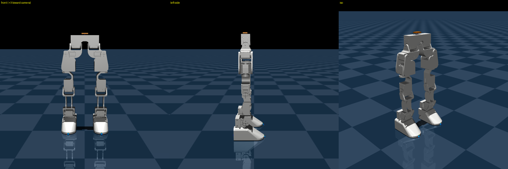

# K2

A 3D-printed 12-DOF bipedal robot that **stands and marches in place** under a
reinforcement-learning policy, with a MuJoCo digital twin generated from the
Fusion 360 CAD export. One policy learns both behaviours and switches between
them at runtime.

| | |
|---|---|
| DOF | 12 revolute — 6 per leg (hip pitch / roll / yaw, knee, ankle pitch / roll) |
| Actuators | 12× Feetech STS3215, 30 kg·cm @ 12 V (2.94 N·m, 4.712 rad/s) |
| Modeled mass | 1.1786 kg |
| Hip height (straight pose) | 336 mm |
| Foot-site stance width (straight pose) | 68 mm |
| Controller | Raspberry Pi 5 (policy inference 0.012 ms/tick on one CPU thread) |
| IMU | LSM6DS3, inside the electronics tray |
| Control rate | 50 Hz (2 ms physics × decimation 10) |



## Scope

This repository covers **hold** (stand still, reject pushes) and **march** (step
in place, zero net translation). Forward walking is not included.

## Layout

```
k2_rl/            mjlab RL task: hold + march, PPO, ONNX export
hardware/         unified sim <-> real control stack (one code path)
policies/         trained policy, ready to deploy
mjcf/             MuJoCo model (generated)
urdf/             Fusion export + mass/limit-corrected URDF (generated)
meshes/K2/        visual .obj + convex collision .stl
scripts/          CAD -> URDF -> MJCF pipeline
docs/             link-to-link transformation matrices
robot.md          complete reference: joints, calibration, twin, deployment
```

Generated files are checked in, so the model and policy work without re-running
anything.

## Quick start

Run the trained policy in the twin:

```bash
python -m hardware.k2_policy_run --bus sim --viewer --mode march \
  --policy policies/march_hold_v4_1999.onnx
```

On the real robot (from the Pi):

```bash
python -m hardware.k2_policy_run --bus /dev/ttyAMA0 --mode hold \
  --policy policies/march_hold_v4_1999.onnx
python -m hardware.k2_policy_run --bus /dev/ttyAMA0 --mode march \
  --march-after 5 --duration 20 --slew 1.0 --fall-angle 10 \
  --policy policies/march_hold_v4_1999.onnx --log run.csv
```

Torque is always released on exit, including Ctrl-C. `--slew` caps per-tick
joint motion and `--fall-angle` cuts torque above a torso tilt.

## Training

Needs [mjlab](https://github.com/mujocolab/mjlab) and a CUDA GPU.

```bash
python -m k2_rl.train Mjlab-InPlace-K2 --env.scene.num-envs 4096 \
  --agent.max-iterations 2000 --agent.run-name march_v4
python -m k2_rl.play  Mjlab-InPlace-K2       --checkpoint-file <run>/model_2000.pt
python -m k2_rl.play  Mjlab-InPlace-March-K2 --checkpoint-file <run>/model_2000.pt
python -m k2_rl.export_onnx --checkpoint <run>/model_2000.pt
```

Both task IDs share one checkpoint — the first plays it holding, the second
marching. `export_onnx` bakes the joint names, default pose and action scale
into the ONNX so the deploy script stays correct across retrains.

## The sim <-> real abstraction

The same program drives MuJoCo or the real servo chain by changing one flag.
The seam is the **servo bus, in raw encoder counts** — the robot's actual wire
language. Everything above it (calibration, count<->rad, observation building,
clamping, slew limiting, control rate) is identical code on both paths.

```bash
python -m hardware.k2_ctrl --bus sim --motion squat --viewer
python -m hardware.k2_ctrl --bus /dev/ttyAMA0 --motion squat
```

## Rebuilding the model from CAD

```bash
python scripts/phase1_mass.py       # -> urdf/K2_phase1.urdf
python scripts/phase2_make_mjcf.py  # -> mjcf/k2_physics.xml
python scripts/phase3_validate.py   # mass, limits, contact, torque
MUJOCO_GL=egl python scripts/render_check.py   # -> images/
python -c "from hardware import k2_conventions as C; C.write_joint_limits()"
```

## Conventions worth knowing before you change anything

- Robot faces world **+X**, **+Y is the robot's own LEFT**, **+Z** is up. This is
  forced: MuJoCo is right-handed, so with +x forward and +z up, +y is left.
- **The MJCF bodies named `*_right` sit at +y, i.e. on the robot's own LEFT.**
  Fusion named them from the viewer's side. `JOINT_TO_ID` accounts for this — read
  the leg-mapping note in `hardware/k2_conventions.py` before touching it.
- The policy's `base_ang_vel` observation is the gyro in the **MJCF `imu` site
  frame**, which is *not* the chip frame. `k2_attitude.py` converts chip -> root
  -> site; skipping that step inverts the pitch and yaw rate channels.
- Collision is **feet only**, so the legs cannot snag on their own shells.
- Timestep is **2 ms**. At 5 ms the foot-ground contact injects energy and the
  robot bounces higher than it was dropped from.
- Every hinge carries `armature=0.01` (STS3215 reflected rotor inertia). Without
  it the resting IMU reading chatters over [-1.8, 24.6] m/s^2 instead of 9.81.
- Joint limits are read from the MJCF into `hardware/joint_limits.json` — never
  hardcoded, so they cannot drift from the model.

## Status

Hold is solid. March runs on hardware but with limited margin — a good run peaks
around 8.6 deg of torso tilt against a 12 deg cutoff, and the sim march itself
only carries about 2.5 deg of roll headroom. Roll is a geometric budget (stance
width vs CoM height), not a reward-tuning knob.

**Known defect:** the left foot's `heel`, `inner` and `outer` sole sites in the
MJCF are not mirrors of the right foot's. This skews `feet_inner_clearance`,
`feet_heel_clearance`, `gait_swing` and `swing_sole_flat` against the left leg.
Correcting the sites requires a retrain to take effect.

See `robot.md` for the full reference and `k2_rl/README.md` for the task design.
